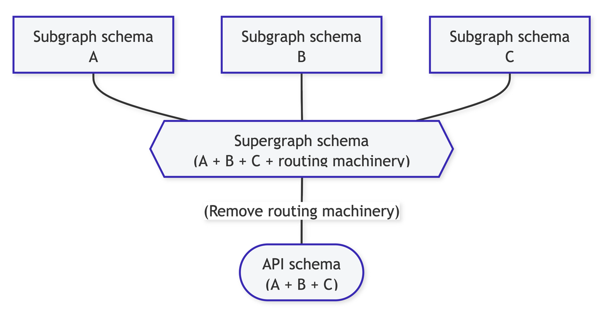

:::info

The concept of Schema is actually quite general, and the Schema we are sharing today refers specifically to the Schema used to represent data types, which is usually used for data type validation. The following solution are currently available in the community.

- JSON Schema
- GraphQL Schema
- IDL
- Farrow Schema (another option)

Farrow Schemad's solution is: TypeScript type and Schema together, providing a new development experience of TypeScript + Schema.

:::

Two main scenarios are of interest in TypeScript + Schema.

- API development at back-end
- Call development at front-end

## Community solutions

Before introducing Farrow Schema. Let's look at the solutions that are already available in the community.

His main area is JSON data format validation for JavaScript, such as the format validation of various JSON configuration files, which is difficult to combine with TypeScript types, as can be seen from his design.

### GraphQL

There are two main directions in the GraphQL direction: the traditional GraphQL Schema-based solution and [NestJS's GraphQL](https://docs.nestjs.com/graphql/quick-start).

#### Official & Apollo

There are two main solutions in the GraphQL direction: [the official one](https://graphql.org/) and [Apollo](https://www.apollographql.com/). They are similar in terms of Schema application, so they are considered together.

##### Call development

In call development scenarios, Schema is mainly used to generate call codes, types, etc. for easy front-end development. Although GraphQL officially and Apollo both have their own solutions, the idea is basically the same: generate front-end TypeScript types.

- GraphQL Code Generator：https://www.graphql-code-generator.com/
- Apollo Type generation： https://www.apollographql.com/blog/tooling/apollo-codegen/typescript-graphql-code-generator-generate-graphql-types/

For example

```graphql
type User {
  id: ID
  name: String
}
```

will be transformed into

```ts
type User = {
  id?: string;
  name?: String;
};
```

Each field is optional (Optional), the front-end to get the type are to each field each field judgment.

If you want to generate:

```ts
type User = {
  id: string;
  name: String;
};
```

GraphQL Schema fields should be required, we need code it as

```graphql
type User {
  id: ID!
  name: String!
}
```

However, this approach makes it impossible to use the slicing feature of GraphQL, i.e. it is not possible to slice the data in the Query Schema, because each field is required.

```graphql
query {
  user {
    id
    name
  }
}
```

In the front-end call scenario, the GraphQL Schema slicing feature is fragmented from the TS type, and although GraphQL has a related type generation tool, the non-required fields in the GraphQL Schema can be sliced off.

Relay supports parsing the front-end Query Schema to get the indeed type.

- (Type Emission)[https://relay.dev/docs/guides/type-emission/]
- (Introducing the new Relay compiler)[https://relay.dev/blog/2021/12/08/introducing-the-new-relay-compiler/]

```ts
import { ExampleQuery } from "__generated__/ExampleQuery.graphql";

const data = useLazyLoadQuery<ExampleQuery>(
  graphql`
    query ExampleQuery($artistID: ID!) {
      artist(id: $artistID) {
        name
      }
    }
  `,
  // variables are expected to be of type ExampleQuery$variables
  { artistID: "banksy" }
);
```

Although it can be done to get the exact type of Query, the threshold is relatively high.

##### Resolver Development

```ts
const resolvers = {
  Query: {
    // no type
    user(parent, args, context, info) {
      return queryUser(args.id);
    },
  },
};
```

In the GraphQL resolver development scenario, the TypeScript types of parameters and return values are also a problem, which cannot be automatically corresponded with the GraphQL Schema and need to be filled in by hand.

##### Conclusion

**Advantages**

- Multilingual support

**Problems**

- GraphQL Schema slicing features in front-end call scenarios conflict with TS type completion.
- TypeScript type fragmentation with Schema in Resolver development scenarios.
- Maintain specific DSLs, increasing maintenance costs.

#### NestJS

Their solution is to implement Schema by Class + Decorators.

```ts
import { Field, Int, ObjectType } from "@nestjs/graphql";

@ObjectType()
export class User {
  @Field((type) => Int)
  id: number;

  @Field()
  name: string;
}
```

Resolver is also implemented via Class + Decorator.

```ts
@Resolver((of) => User)
export class UsersResolver {
  constructor(
    private authorsService: AuthorsService,
    private postsService: PostsService
  ) {}

  @Query((returns) => User)
  async author(@Args("id", { type: () => Int }) id: number) {
    return this.authorsService.findOneById(id);
  }
}
```

##### Conclusion

**Advantages**

- Solved the problem of resolver's type and Schema fragmentation, resolver's development experience is better.

**New problems introduced**

- The same type is written twice: type + custom Schema, but written together, the development experience and maintenance costs are greatly reduced.
- Complex types are not as easy to write as TS type declarations, Nest uses Class to represent ObjectType which cannot be written nested.

**Old unresolved issues**

- The problem of GraphQL Query Schema and front-end type fragmentation is still not solved.

### IDL

## Farrow Schema

As you can see, the type-check and TypeScript type schemes in the existing community are more or less Gap, which makes the TypeScript development experience not so smooth.

In Farrow, we treat TypeScript as a first-class citizen and design a Schema that combines type-checking and TypeScript types.

### Usage

Farrow Schema is written like a TS type declaration, close to what TypeScript developers are used to.

```ts
import { ID, Struct } from "farrow-schema";

const User = Struct({
  id: ID,
  name: String,
});
```

The above `User` can be used for both data validation:

```ts
import { Validator } from "farrow-schema/validator";

const result = Validator.validate(User, {
  id: "foo",
  name: "foo name",
});

if (result.isOk) {
  console.log(result.value);
}
```

It is also possible to derive the TypeScript type:

```ts
import { TypeOf } from "farrow-schema";

type User = TypeOf<typeof User>;

// alternative
type User = {
  id: string;
  name: string;
};
```

### API Development

With Farrow Schema, which has these capabilities, it can be used as the basis for developing rpc-like API interfaces for TypeScript development experiences.

```ts
import { Api } from "farrow-api";

// 拥有类型校验的能力
export const getUser = Api({
  description: "get notes",
  input: { id: String },
  output: User,
});

// 类型推导友好
getUser.use(({ id }) => {
  return queryUser(id);
});
```

Initiated as a service.

```ts
import { Http } from "farrow-http";
import { ApiService } from "farrow-api-server";

const http = Http();

http.use(ApiService({ entries: { getUser } }));

http.listen(3000, () => {
  console.log("Listening on localhost:3000");
});
```

Local testing is also convenient, as it can be performed as a function, without the need to start a Server.

```ts
const user = await getUser.run("foo");
```

### Call Development

We rely on the [**Introspection**](#introspection) feature(will be introduced in the following section) to implement calling code generation.

```ts
import { createApiPipelineWithUrl, ApiInvokeOptions } from "farrow-api-client";

export type User = {
  id: string;
  name: string;
};

export const apiPipeline = createApiPipelineWithUrl();

export const api = {
  /**
   * @remarks get note content
   */
  getUser: (input: { id: string }, options?: ApiInvokeOptions) =>
    apiPipeline.invoke(
      { type: "Single", path: ["getUser"], input },
      options
    ) as Promise<User | UnknownID>,
};
```

The API can be called by calling the function:

```ts
import { api } from "./api";

const user = await api.getUser({ id: "foo" });
```

:::info

- Call-side code type completion.
- Added [dataloader](https://github.com/graphql/dataloader) for automatic and unaware request merging (works with React) and data caching.
  - Works well when getting first screen data.

:::

### Conclusion

**Advantages**

- Development experience is very close to the intuition of TypeScript developers.
- Reduced code volume, one code has type and validation capabilities, reducing development and maintenance costs.
- No need to maintain a specific Schema DSL.
- Easy to test.

**Disadvantages**

- Only for front and back-end projects using TypeScript development (suitable for use in the BFF layer).
- request parameters are specialized and different from the mainstream (RESTful) approach (GraphQL also has the same problem).

## Introspection

With a library based on Farrow Schema, we have extended Introspection with such a powerful feature.

### What

Allows us to get the Schema information for requests supported by the server.

> Sourced from GraphQL https://graphql.org/learn/introspection/
> GraphQL Code Generator, GraphQL Playground are based on this feature

By default, Farrow Server supports fetching Schema information by sending specific requests.

In the server, API development is done and added to the Server as middleware.

```ts
import { ID, Struct } from "farrow-schema";
import { Api } from "farrow-api";

import { Http } from "farrow-http";
import { ApiService } from "farrow-api-server";

const User = Struct({
  id: ID,
  name: String,
});

export const getUser = Api({
  description: "get notes",
  input: { id: String },
  output: User,
});

getUser.use(({ id }) => {
  return {
    id,
    name: `name of ${id}`,
  };
});

const http = Http();

http.use(ApiService({ entries: { getUser } }));

http.listen(3000, () => {
  console.log("Listening on localhost:3000");
});
```

Send request in Postman

```json
{
  "type": "Introspection"
}
```

will get

```json
{​
    "type": "ApiSuccessResponse",​
    "output": {​
        "protocol": "Farrow-API",​
        "types": {​
            "0": {​
                "type": "Struct",​
                "fields": {​
                    "id": {​
                        "typeId": 1,​
                        "$ref": "#/types/1"​
                    }​
                }​
            },​
            "1": {​
                "type": "Scalar",​
                "valueType": "string",​
                "valueName": "String"​
            },​
            "2": {​
                "type": "Struct",​
                "fields": {​
                    "id": {​
                        "typeId": 3,​
                        "$ref": "#/types/3"​
                    },​
                    "name": {​
                        "typeId": 1,​
                        "$ref": "#/types/1"​
                    }​
                }​
            },​
            "3": {​
                "type": "Scalar",​
                "valueType": "string",​
                "valueName": "ID"​
            }​
        },​
        "entries": {​
            "type": "Entries",​
            "entries": {​
                "getUser": {​
                    "type": "Api",​
                    "input": {​
                        "typeId": 0,​
                        "$ref": "#/types/0"​
                    },​
                    "output": {​
                        "typeId": 2,​
                        "$ref": "#/types/2"​
                    },​
                    "description": "get notes"​
                }​
            }​
        }​
    }​
}
```

The call code generation mentioned above is generated from this data.

#### Federation

Before we look at Farrow's Federaion, let's look at [GraphQL's Federation](https://www.apollographql.com/docs/federation/).



**Principle**

- Graph-based partitioning and aggregation
- Different subgraphs are part of the Supergraph and are independent and complete
- Aggregation is performed through a dedicated gateway

**Design Principles**

- Incremental adoption
- Separation of concerns

**Disadvantages**

- Need to generate Schema file and then process it, can't be fully automatic
- Fixed server-side form and client-side form

```ts
const service = await Federation([
  {
    url: "http://localhost:3001/api/user",
    namespace: "user",
  },
  {
    url: "http://localhost:3002/api/blog",
    namespace: "blog",
  },
]);
```

```json
// user
{
    getUser
}

// blog
{
    getBLog
}

// federation
{
    user: {
        getUser
    }
    blog: {
        getBlog
    }
}
```

Calling

```ts
import { api } from "./api";

const user = await api.user.getUser({ id: "foo" });
const blog = await api.blog.getblog({ id: "bar" });
```

### Others

There are some other interesting features based on Farrow Schema.

- (WIP)Generate Documentation
- (Beta)[Playground](https://github.com/farrow-js/playground)
- (WIP)Generate test cases for the interface
- Combining the Fakerjs Mock interface
