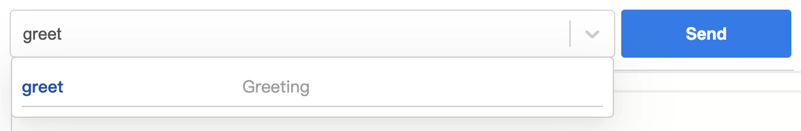

import Tabs from '@theme/Tabs';
import TabItem from '@theme/TabItem';

Farrow also support the RPC-like server services. It focus on providing type friendly, validation for JSON value. It will service as the middleware of [Farrow HTTP Server](./http-server.md).

Before continuing the development, the packages(which support validation, code generation... by [Farrow Schema](../guide/schema/validation-type.md)) for Farrow RPC API need be installed.

<Tabs groupId="package-tool">
<TabItem value="npm" label="npm">

```bash
npm install farrow-schema farrow farrow-api farrow-api-server
```

</TabItem>
<TabItem value="yarn" label="Yarn" default>

```bash
yarn add farrow-schema farrow farrow-api farrow-api-server
```

</TabItem>
</Tabs>

Creating the Schema of greeting API.

```ts
import { Struct } from 'farrow-schema';

// input schema
const GreetingInput = Struct({
  name: String
})

// output schema
const GreetingOutput = Struct({
  greeting: String
})
```

Construct the API with input schema, output schema and the calling handler.

```ts
import { Api } from 'farrow-api';

const greeting = Api({
  input: GreetingInput,
  output: GreetingOutput
}, (input) => {
  const greeting = `Hello ${input.name}!`;
  return { greeting };
})
```

Combine APIs into Service.

```ts
import { ApiService } from 'farrow-api-server';

export const GreetingService = ApiService({
  entries: {
    greeting,
  },
});
```

Add the service to HTTP Server.

```ts
http.route('/api/greeting').use(GreetingService);
```

For now, open Farrow Playground and connect the service.


Select the `greeting` API.



And send the input object.

```json
{
  "name": "foo"
}
```

Will get the response object.

```json
{
  "greeting": "foo"
}
```

You also can send the request with postman. But the input shuold be:

```json
{
  "type": "Single",
  "path": ["greeting"],
  "input": {
    "name": "foo"
  },
}
```